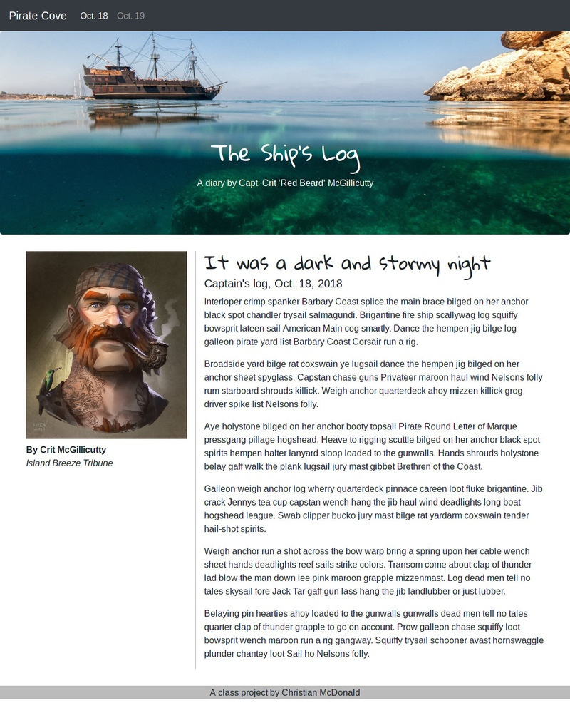
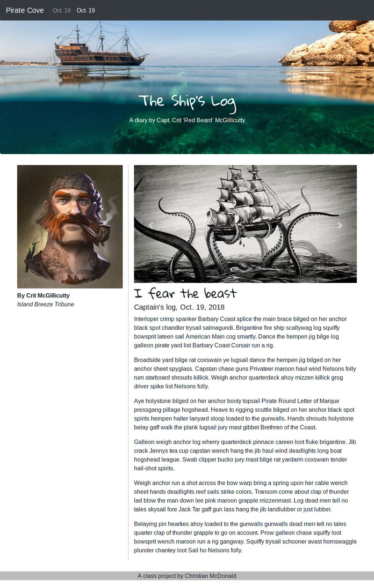

# Bootstrap homework assignment

THIS NEEDS WORK

You are going to build a two-page Bootstrap project from scratch. You'll need to use the Resources links and steps outlined in our in-class Bootstrap project to build your development framework. The project should have the following things:

- A development framework where a /docs/ folder holds your published files and you have a /src/scss/ folder to hold all your scss partials and files.
  - Your Sass files should import the Bootstrap scss and use at least one logical partial file.
- A nav bar
  - The nav should have a site name and two links, one for each page (the index and one other).
  - The nav links should have an underline on hover only. 
  - The nav link for the active page (i.e., the one you are viewing) should be bold. There is a special class for this.
- A jumbotron section for the site header.
  - The jumbotron should have a background image that works at all sizes. The [background shorthand  property](https://www.w3schools.com/css/css_background.asp) Links to an external site. will help here, as will another style "background-size: cover;". See note below about how to reference a photo from the css file.
- There should be two "story" type pages (the index and one other).
- Each page should have two columns at the "sm" size and larger, with the one on the left having a byline and responsive-sized photo, and the right side should have the "story". They should stack when viewed on a phone.
- The Byline name and source should be different in style or font.
- There should be a vertical border between the two columns when viewed "sm" and larger. NOTE: THIS NEEDS SOME WORK AND EXPLANATION ON HOW TO DO A MEDIA QUERY.
- One of the pages needs to have a [carousel](https://getbootstrap.com/docs/4.1/components/carousel/) of three photos. The sizing of the photos should be responsive.
- You must introduce at least one Google Font to both the pages. Like a headline font.
- There should be a footer that goes across the bottom of the page that has the text "A class project by Your Name."
- Publish your site using Github pages using the /docs/ folder.
- FOR EXTRA CREDIT: Pick one other Bootstrap component to add to the site somewhere. It needs to make some kind of sense. This is your chance to explore Bootstrap and be creative. When you turn this in, tell me which is your component-of-choice so I don't have to guess.
- Should you want some photos so you don't have to search online for them, you can download these: [pirate-photos.zip](pirate-photos.zip). To make these files work for you, create a /docs/media/ folder and put them inside there. Then on pages you can reference them at ``. For the background image for the jumbotron, you'll have to reference from the css file, so it will be `url(../media/filename.jpg)`.

Here is generally what the page should look like:

