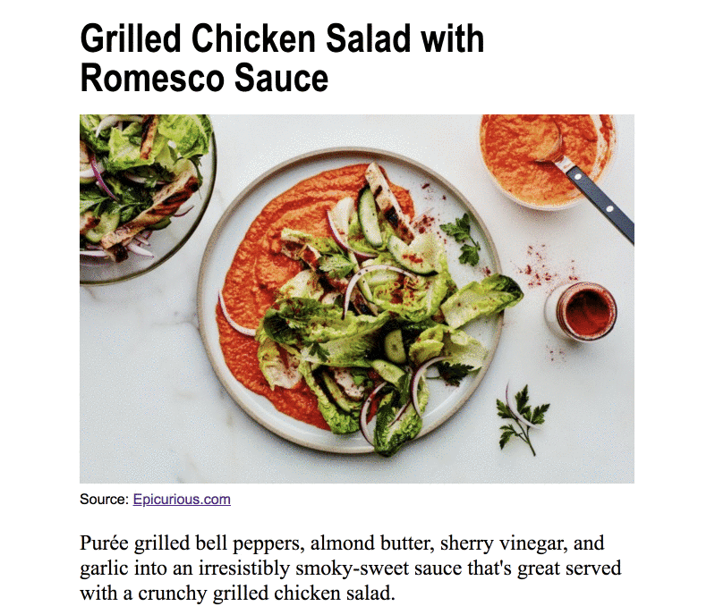
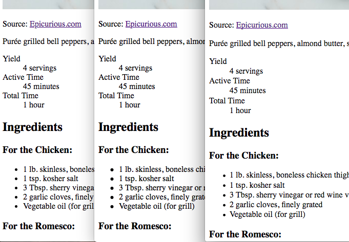

# CSS class exercise

CSS is the skin and DNA attributes that make one HTML skeletons look different from each other. We use CSS to set fonts, colors, positioning and more. In this lesson, we'll take the HTML skeleton we made in our previous lesson, and make it pretty.

## Goals 

- To understand default browser styling and how to handle it.
- To use CSS styles to give visual appeal to page, applying the principles we learned in the Codecademy lessons.

This will be our finished product:



## Resources

You have the internet at your disposal for help. Here are some resources you might find useful.

- You can review steps in the [Codecademy Learn 
CSS](https://www.codecademy.com/learn/learn-css) course.
- You can look up specific resources in the [W3 Schools HTML](https://www.w3schools.com/css/default.asp) documentation. [Shay Howe](https://learn.shayhowe.com/html-css/) has a pretty good tutorial. [Mozilla](https://developer.mozilla.org/en-US/docs/Learn/CSS) also has good CSS docs.
- Google it.

## CSS Reset

Go into your repo from the previous HTML lesson and open in your browser the `recipe.html` file. Your browser will display it just fine, with some default sizing. The problem is, different browsers display defaults just a little bit differently. Here is this page in Chrome, Safari and Firefox. Notice the spacing and bullet sizes are a wee bit different between the versions.



There is way to deal with this called CSS reset. The concept is to zero out all margins, paddings and text sizes so you have a zero base to work from before applying new styles. The version that we will use is from HTML5Doctor, and you can [read about it here](http://html5doctor.com/html-5-reset-stylesheet/).

So, let's do it:

- In your repo, create a new blank file called `reset.css` and then populate it with the contents of the [HTMLDocter reset](https://github.com/richclark/HTML5resetCSS/blob/master/reset.css) file. (You might use the `touch` command to do this, or File > New File in VS Code.)
- We need to add a link in our stylesheet to the reset stylesheet. Put this before the closing `</head>` tag.

```html
  <link rel="stylesheet" type="text/css" href="reset.css">
```

The [link](https://www.w3schools.com/tags/tag_link.asp) tag basically connects to files together. I'll be honest ... I never remember how to write it ... I just look it up when I need it.

Refresh your page and watch your something-kinda-special turn in to muck.

## Relative font sizing

If you've worked with any HTML font sizing in the past, you might be familiar with setting the size of things in pixels, or `px`. When you do that, a user can't increase the size of text in their browse, something a lot of old folks do, present company included.

So there is a way to handle that by setting a base size for fonts, and then making everything else relative to that size. [There is more to it that that](https://www.njimedia.com/how-i-met-the-old-fashioned-way-of-setting-font-sizes/), but know our next move is to set the base font at 62.5%, which will make the normally-default 16px font and makes the base 10px. This allows us to then use a relative measure called a `rem` where `2.4rem` is based 24px for a normally-sized browser.

## Create a site style file, set body defaults

- Create a new file and call it `recipe.css`.
- Now, in your `recipe.html` file, add a `<link>` tag to that that css file after the `reset.css` link.
- Now we'll add some defaults for the `<body>` tag in the `recipe.css` file. Add this to the top, then save both the css and html files.

```css
body {
  font-family: 'Times New Roman', Times, serif;
  font-size: 62.5%;
}
```

If you refresh your page in your browser, you'll see things get worse ... everything is super small now.

## Set article styles

Let's set some boundaries for the article. If you look at the finished example above, the content is a certain width and centered in the page. We're going to define our `<article>` tag to include everything we have in the body currently. We'll add a footer later.

### Add the article tag

- In `recipe.html`, add a beginning `<article>` on a new line after the beginning `<body>` tag.
- Add the closing `</article>` tag before the closing `</body>` tag near the bottom.
- Save the html file.

### Add the article styles

- Now, in `recipe.css`, add the following styles:

> I encourage you to type as much of the code as you can so you understand how the code editor can help you write in the styles. When you get behind, then copy 'n' paste.

```css
article {
  max-width: 620px;
  margin-right: auto;
  margin-bottom: 30px;
  margin-left: auto;
}
```

This `margin-right: auto;` style was discussed in the Learn CSS lesson in Codecademy.

If you've done this right, you should be able to refresh your browser and see everything centered.

## Set text sizes

Let's fix up the text sizes. We're going to set a base size for all basic text elements, and then change them later in the places where we need them. Add this to your styles file:

```css
p, ul, ol, dl {
  font-size: 1.2rem;
  line-height: 1.7rem;
  margin-bottom: 12px;
}
```

What this has done is set all the text elements at basically `12px`, but we've use the `rem` measurement to set it relative to the base size, which was essentially 10px.

We've also given all of those elements a bottom margin so they don't sit on top of each other.

In the case above, it's important that we have commas between each text element. If we don't have those, the browser will think we need all of them together (and) instead of any of them (or).

## Set headline sizes

Now we'll set headlines font and sizes. Add this to your css file, save and refresh your browser:

```css
h1, h2, h3, h4, h5, h6 {
  font-family: 'Franklin Gothic Medium', 'Arial Narrow', Arial, sans-serif;
}

h1 {
  font-size: 2.75rem;
  margin: 20px 0;
}

h2 {
  font-size: 2rem;
  margin: 16px 0;
}

h3 {
  font-size: 1.5rem;
  margin: 14px 0 8px 0;
}
```

The first rule sets the font to a series of sans serif fonts, and we've done it for all headline sizes.

The other rule set sizes and margins for various sizes of headlines. You'll notice that the margins are set in a single line. You can [review the rules here](https://www.w3schools.com/css/css_margin.asp).

## Set the credit

Our next challenge is to set the credit. Because the credit is in a `<p>` tag, we need to add a class attribute to it so we can target it with CSS. We'll use a "class" because credits are not unique, and this way we could set them for all the credits on our site.

- In the html page, add the `class="credit"` attribute to the `<p>` tag so it looks like this:

```html
<p class="credit">
```

- Now that we've defined it, we can add the following styles to your style sheet to target the credit:

```css
.credit {
  margin-top: 2px;
  margin-bottom: 20px;
  font-family: Arial, Helvetica, sans-serif;
}
```

We set the credit as a new font, and then set the top and bottom margins.

### Let's talk about tricks of the trade

Sometimes I have trouble knowing if my CSS property is affecting the thing I want, so sometimes I'll set some crazy rule like `color-background: red;` to make sure I'm targeting what I want.

The other thing I might do is use the browser **Inspector** to play with the style I might like before I write them. It's easier to show this can write it out, but you:
- Use control-click on the element to get the menu for Inspector.
- Make sure you are on the correct element.
- Add rules to the element in the CSS tab and play with them.

Once you figure what you like, then write the rule in the css file.


## Set description style

We want the recipe description to be a bit bigger than the other type. First we need to give it an "id", then give the id a style.

- In the html file, add an `<id>` attribute called "description" to the `<p>` tag. We use `<id>` because there is always only one per recipe.
- In the CSS file, add the following style:

```css
#description {
    font-size: 1.5rem;
    margin-bottom: 20px;
}
```

### Styling elements vs ids vs classes

At this point, you might be confused why sometimes we have a period before a style `.credit` and sometimes a hash `#description` and sometimes nothing `p, ul, li`. Let's define the difference and hopefully it will become clear.

- HTML **elements** are the most generic thing you can style. A `<p>` tag or `<h1>`, etc. If you write a style for one, it affects ALL of those elements on your site.
- But sometimes you have common elements that you re-use often, like byline. You always want those to look a certain way on your site, but you want them to look differently than you body text. So, you "classify" that element with a **class** attribute: `class="whatever"`. Now that it is classified, we can write one style that will affect all the bylines. What you call the class is up to you, but it make sense to call it what it is. When we write a style for one of these classes we indicate that by preceding the class name with a period: `.whatever {font-family: Arial;}`.
- There are also cases on a page where an element is used only one way. In this case we might "identify" that element with an **id** attribute: `id="new-whatever"`. An example might be the main headline of a story; there is always only one. When we use an `id` we are indicating to the browser (and our fellow coders, and even Google) that this element only appears once on this page. When we write a style for an id, we precede the name with a hash to indicate the style is for an id: `#new-whatever {font-family: Times;}`.

## Set the Yield box style

Let's set up the fancy lines above and below the yield values first.

- In your html file, make sure you have a `<div>` surrounding the whole `<dl>` section, and give that div an id of "yield".
- In the css file, add the following:

```css
#yield {
  border-bottom: 1px grey dotted;
  border-top: 1px grey dotted;
}
```

Save and refresh the lines. She used a [shorthand for the border property](https://www.w3schools.com/cssref/pr_border.asp) that allows us to set the size, color and style.

## Set the yield text

Another story about tricks of the trade. When I was preparing this lecture, I had trouble getting the `<dt>` and `<dd>` values to show on the same line. So, what do you think I did? I googled it, of course, using the phrase "make css dd dt on same line". I got my answer [here](https://krijnhoetmer.nl/stuff/css/inline-dl/). It wasn't the first answer of my Google search ... I had to poke around on different Stack Overflow answers until I found one that worked for me.

- Add the following styles to your style sheet.

```css
dl {
  font-family: 'Franklin Gothic', Arial, sans-serif;
  font-size: 1.75em;
  padding: 12px 0;
}

dt {
  float: left;
  margin-right: 5px;
  font-weight: bold;
}
```

The first `<dl>` rule sets the font and size of the text. The next `<dt>` rule floats that part of the description to the left, sets a margin and makes it bold.

- To finish out, go into the html file and add the colon after the `<dt>` values.

Could we have done this with paragraphs or divs? Absolutely. But then you wouldn't have learned about description lists ;-).

## Unordered list margins

The default unordered list looks crappy. Let's line up the bullets to they start with the other words in the article. We do this with [list-position](https://www.w3schools.com/cssref/pr_list-style-position.asp).

- Add to your css file:

```css
ul {
  list-style-position: inside;
  list-style-type: square;
}
```

We did two things here: The position rule moves the list so it starts with the text. The `list-style-type` changed the bullet from a circle to a square. There are [other types as well](https://www.w3schools.com/cssref/pr_list-style-type.asp), and you can even use an image, though we won't get into that here.

## Set the ordered list style

We need to do the same here for ordered lists.

```css
ol {
  list-style-position: inside;
}
```

It works the same way the unordered list did.

## Set the nutrition styles

This is our last challenging piece and we get to learn some more advance CSS foo. This is our goal:


But we have lists, which are a vertical structure. We could separate these into to sections and float them, but if they were generated from an application or CMS of some kind, that would be difficult. We can do it with a special CSS selector called [nth-child](https://www.w3schools.com/cssref/sel_nth-child.asp).

Let's do this in pieces so you can see the magic happen.

- Set the dotted border on the li tags with this:

```css
#nutrition li {
  list-style-type: none;
  border-bottom: grey dotted 1px;
  background-color: red;
}
```

We are adding the background color so you can see the whole outline of each li. We'll take it out later.

Since we only want to change the list items that are within the nutrition div, we have to use both of those selectors. We set removed the list style and then added the grey dotted line. Save and refresh to see your lines.

- Next, in the same rule, let's float all of the list items the left, so add this to the above rule:

```css
  float: left;
```

Save and refresh, and then you'll see all of the list items try to fit on the same space. Well, what we really want is for them to take up half of the space, or 50%.

- Add another value to the same rule. We're using a little less than 50% to give us some wiggle room with margins later:

```css
  width: 48%
```

Save and refresh. Bamm ... we have two on each line. Now we need some space between them. If we add a margin-right call to all the li's, then it would put a margin far to the right as well. This is where the [nth-child](https://www.w3schools.com/cssref/sel_nth-child.asp) comes in. We can add a rule to every ODD numbered item:

```css
#nutrition li:nth-child(odd) {
  clear: both;
  margin-right: 10px;
}
```

OK, we are looking pretty good, but this would look tons better if we could make the grams value flush right in every line. We can do this by putting the two parts of the list items into spans. This is kind of our alternative to the description list that we used for yield.

So, to do this we have to rewrite all the list items to have spans, and then to class those spans so we can target them with css. In order to save time, I'll allow you to copy/paste them.

- In the html file, replace all the li's with this:

```html
        <li>
            <span class="nutri-item">Calories</span>
            <span class="nutri-value">541</span>
        </li>
        <li>
          <span class="nutri-item">Carbohydrates</span>
          <span class="nutri-value">13g (4%)</span>
        </li>
        <li>
          <span class="nutri-item">Fat</span>
          <span class="nutri-value">44g (68%)</span>
        </li>
        <li>
          <span class="nutri-item">Protein</span>
          <span class="nutri-value">23g (46%)</span>
        </li>
        <li>
          <span class="nutri-item">Saturated Fat</span>
          <span class="nutri-value">8g (38%)</span>
        </li>
        <li>
          <span class="nutri-item">Sodium</span>
          <span class="nutri-value">902mg (38%)</span>
        </li>
        <li>
          <span class="nutri-item">Polyunsaturated Fat</span>
          <span class="nutri-value">8g</span>
        </li>
        <li>
          <span class="nutri-item">Fiber</span>
          <span class="nutri-value">4g (18%)</span>
        </li>
        <li>
          <span class="nutri-item">Monounsaturated Fat</span>
          <span class="nutri-value">25g</span>
        </li>
        <li>
          <span class="nutri-item">Cholesterol</span>
          <span class="nutri-value">111mg (37%)</span>
        </li>
```

- Next, add the CSS to make the `nutri-value` spans move to the right:

```css
#nutrition .nutri-value {
  float: right;
}
```

- Once everything is good, you can comment out the red background color, if you haven't already.

## Lets add a footer

You may have noticed that this nutrition div is smack dab at the bottom of the page. Let's add a footer to close of the page nicely.

- Add this to the html file, after the closing `<article>` tag.

```html
  <footer>
    <p>A class project by Your Name</p>
  </footer>
```

If you hit refresh, you'll notice that the footer ends up being way off to the right. This is because of all the floats in the nutrition section. There is a css property called [clear](https://www.w3schools.com/cssref/pr_class_clear.asp) that can help us here.

- Add these values to the css file:

```css
footer {
    clear: both;
    text-align: center;
    margin-top: 200px;
    margin-bottom: 30px;
}
  
footer p {
    font: 1rem Arial;
}
```

We used `clear: both` to make sure there are no floats affecting the footer. Still, because of floats, margins are acting super funky here, and the CSS doesn't understand how deep that nutrition section is, and that is why we have the crazy `200px` value on the margin.

Tricks of the trade lesson #32: If it works, especially if you check all the browsers, then maybe it is good enough.

## Save and push to Github

If we haven't done so already, use the git cycle to push all your code to Github.
