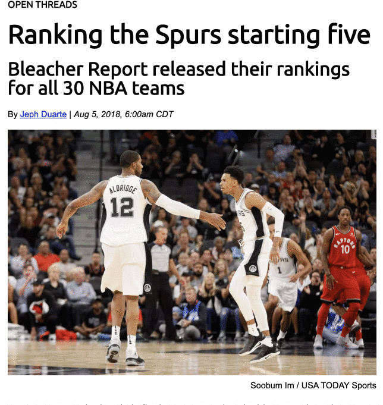

# CSS Practice: Build a sports story

For this practice assignment, you will be picking up from the last HTML practice assignment and enhancing it with your own CSS, with the directions provided below.

We did many of these things with our in-class assignment. You'll also have to figure out some new things, but that is part of coding.

# Goal

To make a news story, something like this:

## Requirements

- Make sure you update your `practice-story.html` file with any of the feedback I gave you when I graded.
- Use a css reset file. You can use the same one we used with the in-class assignment.
- Now that you have a reset css file, you'll need to create a new css file for all your other styles and link it to your html file.
- Set the base font as "Times New Roman" with acceptable backups. Reset the font-size for easier relative sizing by setting the body font size to 62.5%, which is the equivalent of 10px, like we did with the in-class recipe.
- Now set a standard font size for text elements like `
` and `<ul>` tags. (Make the base font larger.) You'll also want to set a bottom margin on those elements so they don't run up against each other.
- Add an `<article>` tag if you need to, then make the max-width of the article 620px and center it.
- In the HTML, set the width of the photo to 620px using a "width" attribute.
- Use [Google Fonts](https://fonts.google.com/) to find and use a font called "Ubuntu" and add that to your page. You'll need to figure out how to do that, but you can figure it out if you read the directions.
- Set all your headlines to use that Ubuntu font (with backups) and set headline sizes that make visual sense, but follow convention. (i.e., make sure h1 is the biggest and is used for the article headline.) Make sure you also include the `<h4>` label above the headline.
- Set the byline and photo credit lines to use the font Arial with an appropriate backup. Adjust sizes so they are visually appealing.
- Use a `` tag around the date in the byline, and set it to font-style of italic.
- Make the photo credit text right-aligned and nudge up the margin so it sits close but not upon the photo so readers know that is what it goes with.
- For the blockquote, set a solid left border that is grey and 4px thick. Add some padding (20px) between this border and the text, and some left margin (30px) to inset into the article.
- For the ordered list style, the numbers should line up with the text in the article. `list-style-position` should help you with this.
- For the "comment-notes" section, set a background-color of #CCC and give the content padding of 12px on all sides.
- Once you are done with everything, push it to Github.
- Turn in the link to your repo.
